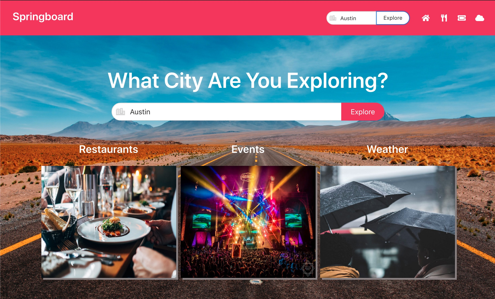

# Mark McDonald's Portfolio

Here is the link to my <a href="https://markmcdnyu.github.io/Portfolio/" target="_blank">portfolio</a> of projects.

##OBJECTIVE 
Showcase my skills as a Software Developer. I am currently finishing the University of Texas Full Stack Web Developer Bootcamp. Once I complete my education in full stack development, I will move forward with a job as a full stack developer.

##ABOUT 
I built out this site using HTML, CSS, Bootstrap, and JavaSctipt. This site will serve as the first building block to my destination — Software Developer. Contact information is in my portfolio page linked above.

##APPLICATIONS
Included in this portfolio are basic "prompt" and "alert" style appplications, to more advanced applications using 3rd party APIs for data. This portfolio will be continuously updated. Below are a few pictures of the apps I have built:

##SpringBoard 
   travel assistant web application using Zomato, OpenWeather and Ticketmaster APIs

##Weather Dashboard
   web application using OpenWeather API to inform a user of weather conditions in a dashboard

##ROLE 
Full Stack Developer

##SKILLS
HTML, CSS, Bootstrap, JavaScript, MySQL, PostgreSQL, MongoDB